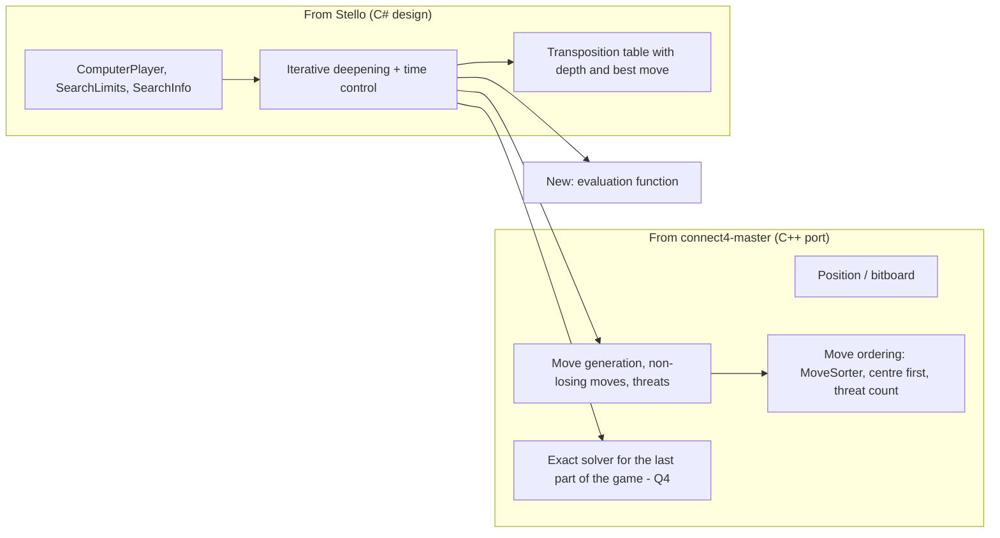

# We want to make a .Net implementation of the Connect 4 game.

## Scope

The project should create a WPF application and Blazor Web app  similar to the VS Solution Stello found in C:\Udvikling\Privat\Stello

The functionality should have the same features like the Stello solution

The Connect 4 brain should be based on the code in connect4-master. This is a C++ project, and it must be translated to a modern c# structure.

**Goal of the brain:** connect4-master is used as a fast search core (bitboard, move generation, threat detection, move ordering, transposition table). It is *not* the goal to solve the game on every move. As in Stello, the search is iterative deepening alpha-beta that stops on a depth or time limit, and a heuristic evaluation function scores the positions at the search horizon. Exact scores are only used when the search reaches the end of the game. There is no large opening book with exact scores.

This is a private project, so licensing (connect4-master is AGPL-3.0) is not an issue.

Items marked **Proposal** are suggested defaults. Items marked **Q** are open questions (collected in the last section).

## 1. Game rules

- Board: 7 columns × 6 rows. Two players, **Red** (moves first) and **Yellow**. Proposal: human is Red at a new game, as Stello's human is Black.
- A move drops a disc into a non-full column. It lands in the lowest empty cell.
- Four in a row horizontally, vertically or diagonally wins. A full board with no four in a row is a draw.
- There are no passes (unlike Othello).
- Column notation: `1`–`7`, left to right, as in connect4-master. A game record is the column sequence, e.g. `4453`.

## 2. Reference sources

| Source | Used for |
|--------|----------|
| `C:\Udvikling\Privat\Stello\Stello.Net` | Solution layout, MVVM architecture, services, UI features, tests, Blazor setup, CI. **Search framework:** iterative deepening, time control (`SearchLimits`, `TimeControl`), cancellation / Move Now, progress reporting (`SearchInfo`), `ComputerPlayer` |
| `C:\Udvikling\Privat\Stello\docs\brain` and `Stello porting documentation.md` | Structure of the documentation to write |
| `connect4-master` (Pascal Pons' solver, C++) | **Search core:** bitboard, move generation, threat detection, non-losing moves, move ordering, transposition table. Optionally the exact solver for the last part of the game (Q4) |

## 3. Solution structure

Mirror Stello's layout. The solution is `Connect4.Net/Connect4.Net.slnx` with the (empty) WPF project `Connect4.WPF`. Its `RootNamespace`, `App.xaml`, `MainWindow.xaml` and the `.cs` files still use the old namespace `Connect_4.WPF` and must be changed to `Connect4.WPF` (Q1).

| Project | Type | TFM | Stello equivalent |
|---------|------|-----|-------------------|
| `Connect4.Engine` | Class library, no UI dependencies | net10.0 | `Stello.Engine` |
| `Connect4.App` | Class library: view models, models, service interfaces (CommunityToolkit.Mvvm) | net10.0 | `Stello.App` |
| `Connect4.WPF` | WPF app (WinExe), exists | net10.0-windows | `Stello.Net` |
| `Connect4.Web` | Blazor WebAssembly, engine in a Web Worker, AOT in Release | net10.0 | `Stello.Web` |
| `Connect4.Engine.Tests` | xUnit | net10.0 | `Stello.Engine.Tests` |
| `Connect4.App.Tests` | xUnit, view model tests with fake services | net10.0-windows | `Stello.Net.Tests` |
| `Connect4.Tools` (optional) | Console app: benchmarks, engine-vs-engine matches for tuning the evaluation, comparison with the C++ solver | net10.0 | – (Q9) |

References: `WPF` → `App`, `Engine`; `Web` → `App`, `Engine`; `App` → `Engine`.

Common settings as in Stello: nullable enabled, implicit usings, no static global state in the engine.

## 4. Engine

The engine combines two sources:

### 4.1 What is ported from connect4-master

| C++ | C# | Notes |
|-----|----|-------|
| `Position` (`Position.hpp`) | `Position` readonly record struct (two `ulong`: `current`, `mask`, plus `moves`) | Bit layout kept: column `c` uses bits `c*7 … c*7+5`, bit `c*7+6` is a sentinel. 49 bits fit in `ulong`. Only 7×6 (Q2). |
| `play`, `canPlay`, `possible`, `isWinningMove`, `canWinNext` | Same names in C# style | 1:1 port. |
| `compute_winning_position`, `winning_position`, `opponent_winning_position` | `WinningCells(player)` | All empty cells that would complete a four. Used by move ordering, pruning **and** the evaluation. |
| `possibleNonLosingMoves` | `NonLosingMoves` | Removes moves that let the opponent win at once. If the opponent has two immediate threats, the position is lost. |
| `moveScore`, `MoveSorter`, `columnOrder` (3,4,2,5,1,6,0) | `MoveOrdering` | TT best move first (from Stello), then C++ order. |
| `popcount` loop | `BitOperations.PopCount` | |
| `key()`, `key3()` | `Key`, `Key3` | `Key` for the transposition table. `Key3` (mirror-symmetric) for the small book (Q5). |
| `Solver::solve` / `negamax` | `EndgameSolver` (optional, Q4) | Exact solve when few empty cells are left, like Stello's endgame solver. With a deadline and cancellation. |
| `TranspositionTable` (8-bit value only) | Replaced by Stello's `TranspositionTable` | The C++ table stores only a score bound. Depth-limited search also needs depth, bound type and best move. |
| `OpeningBook`, `7x6.book`, `generator.cpp` | Not ported | No large exact book (see 4.6). |
| `main.cpp` | Optional `Connect4.Tools` command | Only to compare exact scores with the C++ program. |

### 4.2 Search (Stello design)

- `SearchEngine`: negamax alpha-beta with iterative deepening (depth 1, 2, 3, …) until the limit is reached. Proposal: principal variation search (null window on non-first moves), as the C++ solver uses null windows.
- At each node, in this order:
  1. Draw if the board is full.
  2. If the side to move can win at once → win score (no further search).
  3. `NonLosingMoves`; if empty → loss score.
  4. If only one non-losing move (forced block), search it without reducing the depth (threat extension).
  5. At depth 0 → evaluation function.
  6. Transposition table lookup, then ordered moves.
- `SearchLimits` as Stello: `FixedDepth(plies)`, `TimePerMove(span)`, `TimePerGame(remaining)`, `Solve` (no limit, search to game end).
- `TimeControl`: soft limit (do not start a new iteration) and hard limit (abort the running iteration, use the result from the last completed iteration). Move Now = cancel.
- `SearchInfo` progress per iteration: depth, score, best move, principal variation, nodes, time.
- `SearchResult`: move, score, `ScoreKind` (`Heuristic`, `Exact`, `Book`), depth, nodes.
- The engine is not thread-safe; one search at a time (as Stello).

### 4.3 Scores

- Scores are from the side to move (negamax).
- Heuristic score range, e.g. −1000…1000.
- Win/loss scores outside that range: `Win − ply`, so a faster win scores higher (Stello uses ±32600 in the same way).
- A win/loss found by the search is exact (`ScoreKind.Exact`) even at a limited depth.
- UI: heuristic score shown as a number from Red's view (Q16); exact results as "Red wins in N moves" / "Draw".

### 4.4 Evaluation function (new code)

connect4-master has no evaluation function (it always searches to the end). Proposed terms, all computed with bitboards (Q3):

| Term | Idea |
|------|------|
| Threats | Number of empty cells that complete a four for each player (`WinningCells`). The strongest term. |
| Odd/even threats (zugzwang) | Red (first player) profits from threats on odd rows (1, 3, 5 counted from the bottom), Yellow from even rows. Near the end of the game this decides most games. |
| Stacked / shared threats | Two threats on top of each other in one column usually win. A cell that is a threat for both players. |
| Open lines | Lines of 4 cells with only one colour: count lines with 2 and 3 discs, weighted. |
| Centre | Cell weights by the number of possible lines through each cell (centre column highest). |
| Tempo | Small bonus for the side to move (optional). |

The evaluation must be symmetric: the mirrored position gives the same score, and swapping colours negates it.

Weights are tuned by hand first. Q3: also tune with engine-vs-engine matches in `Connect4.Tools`?

### 4.5 Transposition table

- Stello layout: 2^hashBits slots, entry with key check, depth, bound (exact / lower / upper), value, best move. Replaced on depth or age.
- Proposal: 2^20 entries on desktop, smaller in the browser. Configurable (Q8).
- Cleared at New Game; kept between moves in the same game.

### 4.6 Opening book

No large book with exact scores. Options (Q5):

1. No book: search from move 1 (the empty board has only 7 moves, so a depth-12 search is fast).
2. Small fixed book: e.g. the first 2–4 plies, with a few good alternatives for variation.
3. Stello-style learning book: add played games, self-play. Keyed with `Key3` so mirrored positions share entries.

### 4.7 Computer strength

- As Stello: strength is set by the time control (fixed depth / seconds per move / minutes per game).
- Depth range proposal 1–42 plies (Stello: 1–20). At high depth in the endgame the search becomes an exact solve.
- Q6: extra "easy" levels (e.g. random among non-losing moves, or noise on the score)?
- Q7: pick at random among moves with the same score, so games differ?

### 4.8 Speed

- Target: node rate within 2× of the C++ code, measured in `Connect4.Tools` (Q9).
- No allocations in the search: `Position` is a struct, move lists on the stack.

## 5. Application features

Stello's features and whether they apply to Connect 4:

| Stello feature | Connect 4 | Notes |
|----------------|-----------|-------|
| File: New (Ctrl+N), Open (Ctrl+O), Save (Ctrl+S), Save As, Exit | Yes | File format: plain text with the column sequence, e.g. `4453`. Q8: extension `.c4` or `.txt`? |
| Switch Sides | Yes | |
| Move Now (Ctrl+M) | Yes | Stops the search and plays the best move of the last completed iteration. |
| Undo (Ctrl+Z) / Redo (Ctrl+Y) | Yes | Undo takes back the computer's reply and the human move, as in Stello. |
| Settings dialog | Yes | Same as Stello: fixed depth / seconds per move / minutes per game. Plus Q6/Q7 options. |
| Analysis panel (Ctrl+A) | Yes | As Stello: depth, score, best move, principal variation, nodes, time. Q16: also a score per column above the board? |
| Add Game to Book, Evaluate Book, Self-play, Stop Learning | Depends on Q5 | Only with a learning book. |
| About box (picture, text, version) | Yes | Q10: text and picture. |
| Window placement and settings saved (JSON in AppData / browser local storage) | Yes | |
| Human vs computer only | Q9 | Also human vs human and computer vs computer? |
| No animations, sound, themes, hints | Q9 | Falling-disc animation, winning-line highlight, "hint" button (show best column)? |

Board UI:

- Click anywhere in a column to drop a disc. Hover shows the disc above the column. Full columns and moves while the computer thinks are ignored (beep, as in Stello).
- Highlight the last move and the four winning discs.
- Status line: whose turn, result, notices.

## 6. Blazor web app

As Stello.Web:

- Blazor WebAssembly standalone, engine runs in a Web Worker via `[JSExport]`, AOT compilation in Release (`wasm-tools` workload).
- Pages: `/` game, `/docs` and `/docs/{slug}` brain documentation (Markdown → HTML with Markdig), NotFound.
- Settings in local storage. No book learning (as Stello).
- Smaller transposition table than on desktop (Q8). A small book (if any, Q5) is copied to `wwwroot/data/` at build.
- Deployment: Azure Static Web Apps with a GitHub Actions workflow like Stello's (Q11).

## 7. Tests (xUnit, as Stello)

Engine:

- Position: play, can play, winning move detection in all 4 directions, full columns, draw, `WinningCells`, `NonLosingMoves`, `Key` / `Key3` (mirror positions give the same `Key3`).
- Perft from the empty board, depths 1–8 (depths 1–6 must equal 7^n).
- Evaluation: mirror symmetry, colour swap negates the score, simple hand-made positions (more threats = better).
- Search: finds a win in 1 and blocks a threat at depth 1; finds a known win in N at depth ≥ N; fixed depth is deterministic; time limits and cancellation are respected.
- Exact scores: when the search (or the endgame solver) reaches the end of the game, it must agree with known results. Pascal Pons' test sets (`Test_L3_R1` = end-game positions, "position score" per line) are good for this (Q14).
- Transposition table: store/lookup, bounds, replacement.
- Strength: plays against random and greedy players and wins (as Stello's `StrengthTests`).

App:

- `MainViewModel` with fake services: new game, play, computer reply, undo/redo, switch sides, open/save, settings persistence.

## 8. Documentation

As Stello's `docs/brain`, chapters in Markdown, also shown in the web app:

1. Overview
2. Board and bitboard
3. Rules, move generation, threats and non-losing moves
4. Game record
5. Evaluation
6. Move ordering
7. Search (alpha-beta, iterative deepening, threat extension)
8. Transposition table
9. Endgame solver (if Q4)
10. Time control
11. Opening book (if Q5)
12. App integration
13. Glossary
14. References (Pascal Pons' blog: http://blog.gamesolver.org)

Plus `Connect 4 porting documentation.md` like Stello's: per part, the C++ original, the C# code, and whether it is a 1:1 port or changed.

## 9. Proposed phases

1. Fix the namespace, create the solution structure (Q1).
2. Engine: `Position`, rules, threats, perft tests.
3. Engine: evaluation function and tests.
4. Engine: search, transposition table, move ordering, time control, tests.
5. Engine: endgame solver (Q4) and opening book (Q5).
6. `ComputerPlayer`, strength settings.
7. Tools: benchmarks and engine-vs-engine matches; tune the evaluation (Q9).
8. `Connect4.App`: view models and services.
9. WPF UI.
10. Blazor web app, Web Worker, docs pages.
11. Documentation and CI.

## 10. Open questions

- **Q1 Naming:** Change the namespace `Connect_4.WPF` to `Connect4.WPF`? Are the new project names in section 3 OK?
- **Q2 Board size:** Fixed 7×6 only?
- **Q3 Evaluation:** Are the terms in 4.4 what you want, or do you have your own ideas (e.g. from Stello's evaluation style)? Tune by hand only, or also with engine-vs-engine matches?
- **Q4 Endgame solver:** Use the exact C++ solver when few cells are empty (like Stello's endgame solver at ≤ 7 empty squares)? If yes, from how many empty cells (e.g. ≤ 16), or only when there is time left?
- **Q5 Opening book:** No book, a small fixed book, or a Stello-style learning book (Add Game, Self-play)?
- **Q6 Easy levels:** Is time control enough, or also "easy" levels with random/weaker moves for beginners?
- **Q7 Variation:** Pick at random among equally good moves, so the computer does not play the same game every time?
- **Q8 Memory:** Transposition table size on desktop and in the browser (proposal 2^20 entries desktop, smaller web)?
- **Q9 Tools:** Include `Connect4.Tools` (benchmarks, engine matches, compare with C++)? BenchmarkDotNet?
- **Q10 File format:** Plain column sequence (`4453`) in `.txt` or a custom extension? Also copy/paste of the sequence?
- **Q11 Extra features:** Human vs human, computer vs computer, hint button, disc-drop animation, winning-line highlight, sound, themes, Danish/English UI?
- **Q12 About box:** Same text, picture and style as Stello, or new content?
- **Q13 Deployment:** Azure Static Web Apps like Stello? Which repository/branch?
- **Q14 Test data:** Download Pascal Pons' test sets into the test project to check exact end-game scores?
- **Q15 Colours:** Red/Yellow (classic) or other names/colours?
- **Q16 Score display:** Heuristic score from Red's view or from the side to move? Show a score per column (costs extra search time)?