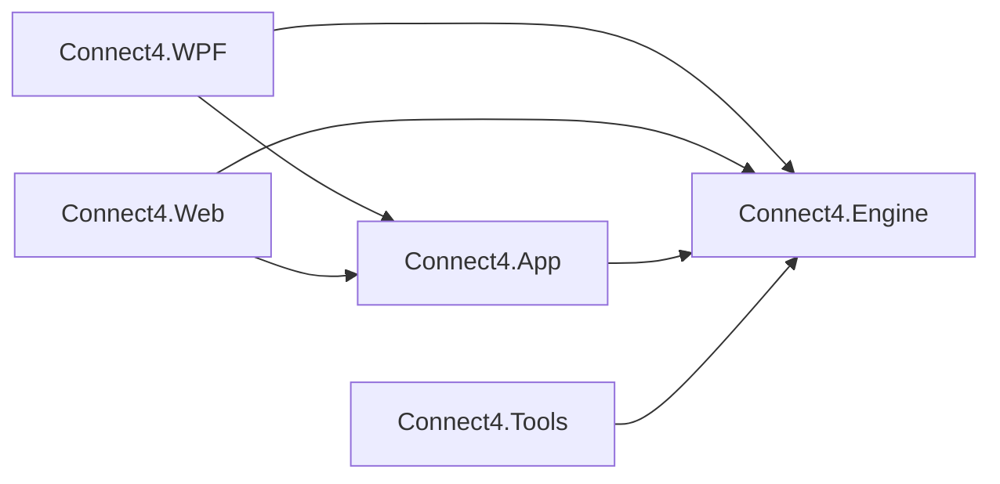

# 01 – Overview

[Back to the index](README.md)

## In short

The solution [Connect4.Net.slnx](../../Connect4.Net/Connect4.Net.slnx) has five projects and two test projects. The brain is `Connect4.Engine`; it has no user interface and no global state (the built-in opening book is read-only). `Connect4.App` holds everything the two user interfaces share (view models, settings, service interfaces), and `Connect4.WPF` and `Connect4.Web` are thin shells around it. `Connect4.Tools` makes the opening book.

## Projects

| Project | Type | Contents |
|---|---|---|
| `Connect4.Engine` | Class library (`net10.0`) | Board, rules, game record, evaluation, search, endgame solver, opening book |
| `Connect4.App` | Class library (`net10.0`) | View models (CommunityToolkit.Mvvm), settings, service interfaces, generated sounds |
| `Connect4.WPF` | WPF app (`net10.0-windows`) | The desktop window, dialogs and services |
| `Connect4.Web` | Blazor WebAssembly (`net10.0`) | The web version; the engine runs in a Web Worker |
| `Connect4.Tools` | Console app (`net10.0`) | `book generate` and `book verify` (chapter 14) |
| `Connect4.Engine.Tests` | xUnit | Engine tests, including Pascal Pons' test positions |
| `Connect4.App.Tests` | xUnit (`net10.0-windows`) | View model tests with fake services |

## Main types of the engine

| Type | Chapter | Purpose |
|---|---|---|
| `Position` | 02, 03 | An immutable board: two bitboards and the move count |
| `Player` | 02 | `Red` (moves first) or `Yellow` |
| `Game`, `GameRecordFormat` | 04 | Move history with undo/redo; the `4453` text format |
| `Evaluator`, `EvaluationWeights` | 05 | The heuristic score of a position |
| `MoveSorter`, `Search/MoveOrdering` | 06 | The order in which moves are searched |
| `SearchEngine` | 07 | Iterative deepening alpha-beta |
| `Search/TranspositionTable` | 08 | The hash table of the search |
| `Endgame/EndgameSolver`, `Endgame/EndgameTable` | 09 | The exact C++ solver and its hash table |
| `SearchLimits`, `Search/TimeControl` | 10 | Fixed depth, time per move, time per game |
| `SearchResult`, `SearchInfo`, `ScoreKind`, `Scores` | 07 | Results, progress reports and score conventions |
| `Book/OpeningBook`, `Book/BookBuilder`, `Book/BookFile` | 14 | The opening book: lookup, building, the text format |
| `ComputerPlayer` | 11 | The entry point for the app: one move for a game |

## Where the ideas come from

| Part | Source |
|---|---|
| Bitboard, winning cells, non-losing moves, move score, column order | connect4-master (`Position.hpp`, `Solver.cpp`), ported 1:1 |
| Endgame solver and its hash table | connect4-master (`Solver.cpp`, `TranspositionTable.hpp`), ported 1:1 |
| Iterative deepening, time control, Move Now, progress, the MVVM app | Stello (the Othello program by the same author) |
| Evaluation, forced-move extension, random choice between equal moves | New for this project |
| Opening book | The idea and the enumeration from connect4-master (`generator.cpp`); full width with backed-up scores is new |

## The life of one computer move

1. The human drops a disc; `MainViewModel` plays it and starts the computer (chapter 11).
2. The view model asks the `IEngineHost` for a move with the game's moves and the `SearchLimits` from the settings. On the desktop the engine runs on a thread-pool thread; in the browser in a Web Worker.
3. `ComputerPlayer.ChooseMove` checks that the game is not over and calls `SearchEngine.Search`.
4. In the first 6 plies `Search` plays the best move from the opening book at once (chapter 14).
5. Otherwise it plays a winning move at once, returns a loss if every move loses, and plays a single non-losing move without searching.
6. Otherwise it searches depth 1, 2, 3, … (chapter 07) until the result is exact or the depth or soft time limit is reached (chapter 10). Each root move sends a `SearchInfo` to the analysis panel.
7. Near the end of the game the endgame solver may take over (chapter 09).
8. Among the moves with the best score one is picked at random, and the `SearchResult` goes back to the view model, which plays the move.

## Design principles

- **Immutable positions.** `Position` is a small `readonly record struct` (two `ulong` and an `int`); playing a move returns a new position, so the search needs no undo.
- **One search at a time.** `SearchEngine` is not thread-safe; the app never starts a second search before the first has stopped.
- **No allocations in the search.** Move lists are `MoveSorter` structs on the stack.
- **Repeatable.** For the same position, limits, hash table contents and random seed the result is always the same; the tests seed the random generator.
- **Tested against independent code.** The bitboards are checked against a slow grid board (`ReferenceBoard` in the tests), the solver against Pascal Pons' test positions with known exact scores.
