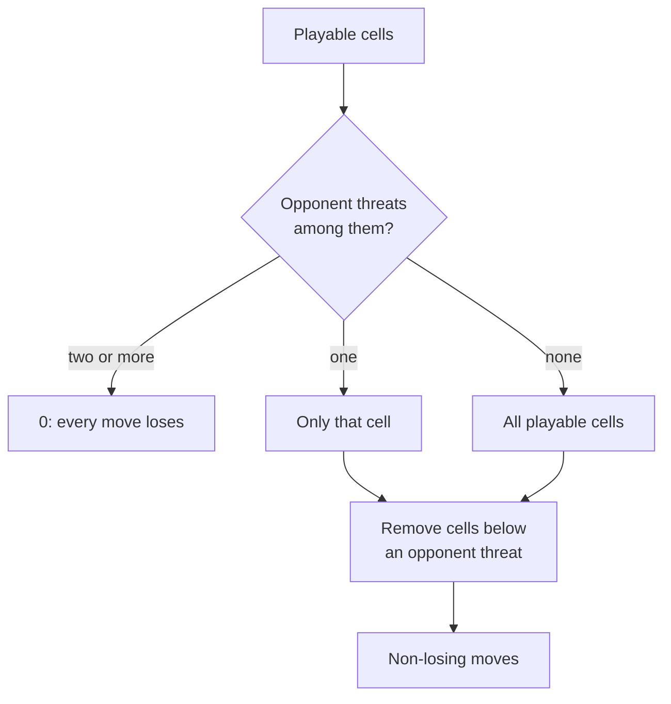

# 03 – Rules and move generation

[Back to the index](README.md)

## In short

A move drops a disc into a column that is not full; four in a row (horizontally, vertically or diagonally) wins, and a full board without four in a row is a draw. The engine never plays past a win: the search checks for a winning move first. All the checks are bitboard operations from connect4-master.

## Playing

| Member of `Position` | Meaning |
|---|---|
| `CanPlay(column)` | The top cell of the column is empty |
| `Play(column)` | Returns the new position; throws for a full column or a column outside 0–6 |
| `PlayMove(move)` (internal) | Plays a move given as one bit of `Possible`; no checks (used by the search) |
| `IsFull` | 42 discs |

Like the C++ class, the search functions assume that the position contains no four in a row. `Game` (chapter 04) records the winner when a winning move is played.

## Winning cells

`ComputeWinningPosition(discs, mask)` returns every **empty** cell where one more disc of `discs` completes a four. It works on all cells at once with shifts. Moving one step on the board is a fixed shift of the bit number $b$ (chapter 02):

```text
up-left    b-6    up      b+1    up-right    b+8
left       b-7            b      right       b+7
down-left  b-8    down    b-1    down-right  b+6
```

So the four directions have the shifts $s$ = 1 (vertical), 7 (horizontal), 6 and 8 (the diagonals). For each of them, shifted copies of the discs $d$ are combined, for example horizontally:

$$
p = (d \ll 7) \mathbin{\&} (d \ll 14), \qquad
r = (p \mathbin{\&} (d \ll 21)) \mid (p \mathbin{\&} (d \gg 7))
$$

and the same for the other side, so all four positions of the empty cell in a line are covered. `d << 7` has a 1 at cell $x$ when the cell to the left of $x$ has a disc, so each term below checks three cells around an empty cell $x$ (`_`):

| Line (left to right) | Discs needed at | Term |
|---|---|---|
| `X X X _` | $x-21$, $x-14$, $x-7$ | $(d \ll 7) \mathbin{\&} (d \ll 14) \mathbin{\&} (d \ll 21)$ |
| `X X _ X` | $x-14$, $x-7$, $x+7$ | $(d \ll 7) \mathbin{\&} (d \ll 14) \mathbin{\&} (d \gg 7)$ |
| `X _ X X` | $x-7$, $x+7$, $x+14$ | $(d \gg 7) \mathbin{\&} (d \gg 14) \mathbin{\&} (d \ll 7)$ |
| `_ X X X` | $x+7$, $x+14$, $x+21$ | $(d \gg 7) \mathbin{\&} (d \gg 14) \mathbin{\&} (d \gg 21)$ |

Vertically only the cell above three discs can complete a four. The result is ANDed with the empty cells (`BoardMask ^ mask`).

These cells are called **threats** in these documents. They are used by the pruning below, by the move ordering (chapter 06) and by the evaluation (chapter 05).

| Member | Meaning |
|---|---|
| `WinningCells(player)` | The threats of a player |
| `CanWinNext` | A threat of the side to move is playable now |
| `IsWinningMove(column)` | Playing this column wins |
| `FindFours(discs)` | The discs of every four in a row (for the highlight of the winning line) |

## Non-losing moves

`NonLosingMoves()` (C++ `possibleNonLosingMoves`) removes the moves that let the opponent win on the next move. It may only be called when the side to move cannot win at once.

1. Take the playable cells and the opponent's threats.
2. If the opponent can win in more than one playable cell, every move loses: return 0.
3. If the opponent can win in exactly one playable cell, that is the only move (a **forced block**).
4. Remove the cells directly below an opponent threat (`opponentWin >> 1`): playing there would let the opponent win on top.

```text
one column
row 4   .    Yellow's threat: a Yellow disc here makes four
row 3   .    removed: after Red plays here, Yellow plays on top and wins
row 2   R
row 1   Y
```



For the search this is a strong and cheap pruning: a position with no non-losing move is a loss without searching further, and a single non-losing move does not use up depth (chapter 07).

## Perft

Counting all move sequences of a given length (a win ends the sequence) checks the move generation. From the empty board, depths 1–6 give $7^n$ (no column can be full and nobody can win yet), and depth 7 gives $7^7 - 7 = 823\,536$: the seven sequences that fill one column in the first six moves have only six seventh moves. Depth 8 is compared with the grid board of the tests.

## How it is tested

[PositionTests.cs](../../Connect4.Net/Connect4.Engine.Tests/PositionTests.cs) plays 1 500 random games and compares every position with `ReferenceBoard`, a slow grid board without bit tricks: the cells, the playable columns, the winning moves, the threats of both players and the non-losing moves. [PerftTests.cs](../../Connect4.Net/Connect4.Engine.Tests/PerftTests.cs) checks the counts above. All 6 000 test positions of Pascal Pons are played with `FromMoves`.
