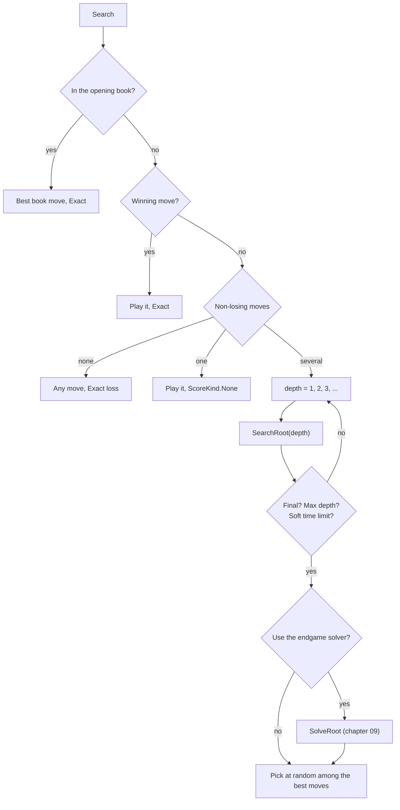
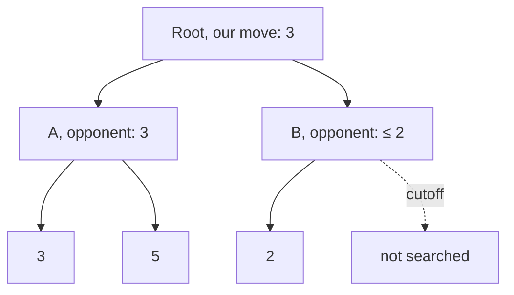

# 07 – Search

[Back to the index](README.md)

## In short

`SearchEngine` ([SearchEngine.cs](../../Connect4.Net/Connect4.Engine/SearchEngine.cs)) looks ahead with **negamax alpha-beta**, as Stello does: it tries its moves, the replies, the answers to those, and scores the positions at the end of each line with the evaluation (chapter 05). It searches **iteratively deeper** (depth 1, 2, 3, …) until the result is exact or the depth or time limit is reached (chapter 10). On top of Stello's design it uses the Connect 4 pruning of connect4-master: an immediate win ends a line, a position without a non-losing move is lost, and a single forced move does not use up depth.

## Scores

Scores are from the side to move ([Scores.cs](../../Connect4.Net/Connect4.Engine/Scores.cs)).

| Score | Meaning |
|---|---|
| −1 000 … 1 000 | Heuristic (evaluation points) |
| 0 with `ScoreKind.Exact` | A draw |
| $\text{Win} - n$ with $\text{Win} = 10\,000$ | A win with the winning disc as the $n$-th disc on the board |
| $-(\text{Win} - n)$ | A loss in the same way |

Because $n$ is the absolute move number, a faster win scores higher, and the score of a position does not depend on where the search started, so it can be stored in the hash table as it is. `Scores.IsDecided(score)` is true beyond ±1 000; the app shows such scores as "Red wins in 3 moves".

```text
-(Win - 7) ... -(Win - 42)     -1 000 ........ 0 ........ +1 000     Win - 42 ... Win - 7
  losses: the latest loss        heuristic scores (evaluation)         wins: the fastest win
  is the highest                                                       is the highest
```

`SearchResult` returns the move (0-based column), the score, the `ScoreKind` (`None`, `Heuristic`, `Exact`), the depth, the nodes, the time, the expected line of play (the principal variation, read from the hash table) and `FromBook`, which is true for a move from the opening book (chapter 11).

## Search as a whole

`Search(position, limits, progress, cancellationToken, moveNowToken)`:



A result is **final** when searching deeper cannot change it:

- the depth has reached the number of empty cells (every line ends in a win, loss or full board), or
- the score is decided and the depth is at least the distance to the winning move. Before that, a faster win could still exist: a forced-move extension (below) can find a long win at a small depth while a shorter one is still beyond the horizon.

## One node

Alpha-beta skips moves that cannot change the result. In this small example (shown as minimax: the root picks the highest score, the opponent the lowest) the first reply to move B already scores 2. The opponent will pick at most 2 after B, and the root already has 3 from A, so B's other replies are not searched: a **cutoff**.



Negamax writes the same with every score from the side to move, so each level negates the scores of the level below and the window $(\alpha, \beta)$ becomes $(-\beta, -\alpha)$.

`Negamax(position, depth, alpha, beta)` is fail-soft; the child is searched with the window (−β, −α):

1. Count the node; every 1 024 nodes check cancellation, Move Now and the hard time limit.
2. If the side to move can win at once: return $\text{Win} - (\text{Moves} + 1)$.
3. `NonLosingMoves()`; if there is none, the opponent wins next move: return $-(\text{Win} - (\text{Moves} + 2))$.
4. With 40 or more discs and a non-losing move, the game is a draw: return 0.
5. **Mate-distance bounds:** we cannot win before move Moves + 3, and the opponent not before move Moves + 4, so β is lowered to $\text{Win} - (\text{Moves} + 3)$ and α raised to $-(\text{Win} - (\text{Moves} + 4))$ (as the C++ solver does with its scores). If the window becomes empty, return.
6. If there is only **one** non-losing move (usually a forced block), it is searched without using up depth: the **forced-move extension**. Otherwise at depth 0: return the evaluation.
7. Look up the hash table (chapter 08): an entry with enough depth and a usable bound returns at once; otherwise its best move is tried first.
8. Order the moves (chapter 06) and search them: the first with the full window, the others with a null window (−α − 1, −α) and again with the full window if they are better. This is **principal variation search**.
9. Store the result with its bound (exact, lower or upper) in the hash table.

Steps 2–4 make the search much smaller than a plain alpha-beta: a line that loses at once is never followed, and a forced block is free.

## The root and equal moves

`SearchRoot` searches every root move. To pick at random among equally good moves, it must know which moves have *exactly* the best score, which a null window cannot tell. So after the first move, every other move is searched with the window (best − 1, best + 1):

- a result below best is worse;
- exactly best is a tie, and the move is added to the list of best moves;
- above best is better, and the move is searched again with (best, +∞) for its exact score.

This costs a little time at the root only. After each iteration the best moves are moved to the front of the root list, so the next iteration starts with them. At the end one of them is picked with the engine's `Random`, which the tests seed so results are repeatable. A win is always the fastest one (a faster win has a higher score); only wins of the same length are picked at random, and a lost position plays the slowest loss.

## Progress

After each root move a `SearchInfo` is reported: depth, the move just searched, the best move, the score, the nodes, the time, the principal variation, and whether the endgame solver is running. The app shows it in the analysis panel (chapter 12).

## Speed

About 6–7 million positions per second on the desktop, and about the same in the browser with WebAssembly AOT. From the empty board the search reaches depth 15 in 1 second and depth 19 in 5 seconds. There are no allocations in the search: positions are structs and the move lists are on the stack.

## How it is tested

[SearchEngineTests.cs](../../Connect4.Net/Connect4.Engine.Tests/SearchEngineTests.cs): winning at once, blocking, a double threat; exact scores and optimal moves (checked with the solver) when the search reaches the end; a win two moves ahead at depth 4; the same seed gives the same moves; equal mirror moves are picked at random; time limits, Move Now, cancellation, the endgame threshold and progress reports; and games against a random player (always won) and a greedy player (at least 9 of 10 won, none lost).
