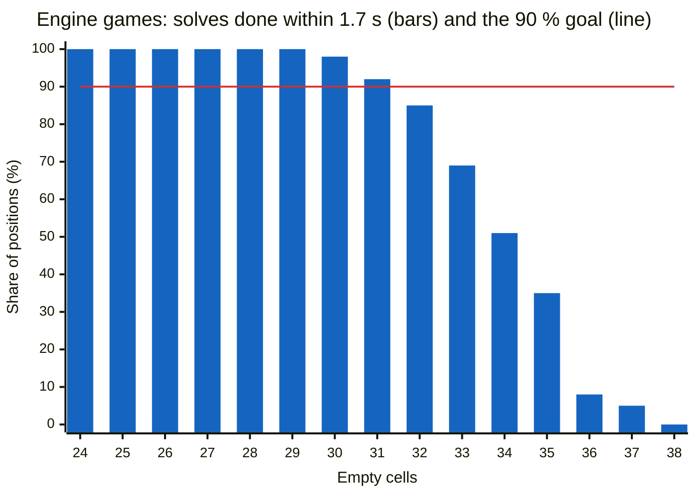

# 09 – Endgame solver

[Back to the index](README.md)

## In short

Near the end of the game the computer can work out the exact result. `EndgameSolver` ([EndgameSolver.cs](../../Connect4.Net/Connect4.Engine/Endgame/EndgameSolver.cs)) is Pascal Pons' C++ solver, ported 1:1 without its opening book. It searches to the end of the game with null-window alpha-beta and its own hash table. The heuristic search runs first and always gives a move; the solver is then tried with the time that is left.

## Scores

The solver uses the C++ scores, from the side to move:

$$
\text{score} = 22 - n
$$

where $n$ is the winner's own disc number for the winning disc (counting that player's discs from 1). The fastest possible win, with the fourth disc, scores 18; a win with the last disc scores 1; 0 is a draw; a loss is the negative. The test files use the same scores. `Scores.FromSolver` converts them to the search scores of chapter 07: Red's $n$-th disc is move $2n - 1$, Yellow's is move $2n$.

## The algorithm

`Solve(position)`:

1. If the side to move can win at once, return $(43 - \text{Moves}) / 2$.
2. Start with the possible range $[\min, \max]$ and narrow it with **null-window** searches: pick a value `med` in the range (biased towards 0, first `min / 2` or `max / 2`), and ask `Negamax(position, med, med + 1)` whether the score is above `med`. Each answer halves the range, until $\min = \max$.

`Negamax(position, α, β)` is the C++ function:

1. `NonLosingMoves()`; none: lost on the next move.
2. With 40 or more discs: a draw.
3. Tighten α and β with the best and worst score still possible from this move count.
4. Look up the hash table; its value is an upper or a lower bound, which may tighten the window further.
5. Order the moves (chapter 06, without a hash move) and search them.
6. Store a lower bound after a cutoff, otherwise an upper bound.

With `weak: true` the range is [−1, 1]; as in C++, only the sign of the result is then exact.

For example, for the empty board (score 1) the range starts at [−21, 21]. If every test only answers yes or no, eight null-window searches find the score; a real search often returns a tighter bound and needs fewer:

| Test | Range | `med` | Score > `med`? | New range |
|---:|---|---:|---|---|
| 1 | [−21, 21] | −10 | yes | [−9, 21] |
| 2 | [−9, 21] | 10 | no | [−9, 10] |
| 3 | [−9, 10] | −4 | yes | [−3, 10] |
| 4 | [−3, 10] | 5 | no | [−3, 5] |
| 5 | [−3, 5] | 2 | no | [−3, 2] |
| 6 | [−3, 2] | −1 | yes | [0, 2] |
| 7 | [0, 2] | 1 | no | [0, 1] |
| 8 | [0, 1] | 0 | yes | [1, 1] |

The first tests ask about half the possible score (−10, 10) rather than the middle (0). A test far from 0 asks about a fast win or loss, which only needs short lines and is cheap to answer; a test near 0 needs lines to the end of the game.

`Analyze(position)` solves the position after every move (a full column gets `InvalidMove`). The search uses it to find the best move, because `Solve` only gives the score of the position. A strong solve is used, not the weak one, because the computer must play the fastest win.

## The hash table

[EndgameTable.cs](../../Connect4.Net/Connect4.Engine/Endgame/EndgameTable.cs) is the C++ `TranspositionTable`:

- The size is the first prime above $2^{24}$, 16 777 259 entries.
- Each entry is a 32-bit part of the key and one byte for the value, so the table takes about 84 MB.
- The slot is $\text{key} \bmod \text{size}$. Because the size is prime and the stored part is the key modulo $2^{32}$, the pair (slot, stored part) is unique for every 49-bit key (the Chinese remainder theorem): a hit is never wrong.
- The byte holds an upper bound as $\text{score} + 19$ (1–37) or a lower bound as $\text{score} + 56$ (38–74); 0 means empty. The last entry stored in a slot wins.

It is created the first time the solver runs and kept for the whole session: its results never go stale, so later moves in the same game are usually solved at once.

## When it is used

| Time mode | The solver runs when | Its time |
|---|---|---|
| Seconds per move, minutes per game | The empty cells are at most the **endgame threshold** (setting, 0–42, default 30; 0 = never) and the hard time limit is not reached | Until the hard limit |
| Fixed depth | The empty cells are at most the depth setting | No limit; only Move Now stops it |
| `Solve` (tests) | Always | No limit |

The heuristic search runs first. In fixed-depth mode it is then limited to 8 plies, because it only has to give a move in case Move Now stops the solver. The solver is skipped when the heuristic search has already found a final result.

If the solver runs out of time or Move Now is pressed, it throws `OperationCanceledException`, and the move of the heuristic search is played. The time limit is checked with a clock every 1 024 nodes, not with a timer: in the browser the engine runs in a Web Worker, where a timer cannot fire while the search runs.

## Choosing the threshold

The search stops starting new depths at 2/3 of the time for the move (chapter 10), so with the default 5 s per move the solver gets at most the last 1.7 s. `Connect4.Tools endgame measure` times the solve the engine does (every move, from an empty table) by number of empty cells:

```text
Connect4.Tools endgame measure [--from 24] [--to 33] [--games 100] [--per-set 50] [--limit-ms 1700] [--cap 30] [--workers 1]
```

It uses positions from games the engine plays against itself, with 15 % random moves as a human would make, and from Pascal Pons' test sets `Test_L1_R2`, `Test_L1_R3` and `Test_L2_R2`. The result on the desktop, with one thread:

| Empty cells | 90 % finish within (games / test sets) | Share within 1.7 s (games) |
|---|---|---|
| 24 | 0.014 s / 0.018 s | 100 % |
| 28 | 0.10 s / 0.15 s | 100 % |
| 30 | 0.51 s / 0.37 s | 98 % |
| 31 | 1.40 s / 0.71 s | 92 % |
| 32 | 2.36 s / 1.74 s | 85 % |
| 33 | 3.74 s / 3.23 s | 69 % |
| 34 | 7.0 s / 4.7 s | 51 % |
| 36 | 26 s / 17.6 s | 8 % |

The time roughly doubles with each extra empty cell. 31 is the largest count where 90 % finish within 1.7 s; the browser is about half as fast, so the default is 30 (it was 24 before the measurement).



A solve that does not finish only costs thinking time: the move of the heuristic search is played. In a game the table is kept between moves, so real solves are faster than measured.

## Speed

About 12 million positions per second on the desktop. Solving from the beginning of the game without a book can take long: the hardest test set (`Test_L1_R3`) takes about 2.4 seconds per position.

## How it is tested

[EndgameSolverTests.cs](../../Connect4.Net/Connect4.Engine.Tests/EndgameSolverTests.cs) solves Pascal Pons' test positions and compares them with the exact scores:

| Set | Positions | Run |
|---|---|---|
| `Test_L3_R1` (end, easy) | 1 000 | Always |
| `Test_L2_R1` (middle, easy) | 1 000 | Always |
| `Test_L2_R2` (middle, medium) | 1 000 | The first 100 always, all as a slow test |
| `Test_L1_R1`, `Test_L1_R2`, `Test_L1_R3` (beginning) | 1 000 each | Slow tests only |

Slow tests are run on purpose with `dotnet test Connect4.Engine.Tests -c Release -s Connect4.Engine.Tests/slow.runsettings`; `Test_L1_R3` alone takes about 40 minutes. Also tested: weak solves, `Analyze`, cancellation and the time limit, and the hash table.
