# 10 – Time control

[Back to the index](README.md)

## In short

How long the computer may think is set in the Settings dialog, with the same three modes as Stello. The search has a **soft** limit (do not start another depth) and a **hard** limit (stop at once and play the best move of the last finished depth). The endgame solver gets the time up to the hard limit.

## The limits

`SearchLimits` ([SearchLimits.cs](../../Connect4.Net/Connect4.Engine/SearchLimits.cs)):

| Mode | Created with | In the app |
|---|---|---|
| `FixedDepth` | `SearchLimits.FixedDepth(plies)` | 1–20 plies |
| `TimePerMove` | `SearchLimits.TimePerMove(time)` | 1–60 seconds (default 5) |
| `TimePerGame` | `SearchLimits.TimePerGame(remaining)` | 1–60 minutes for the whole game |
| `Solve` | `SearchLimits.Solve` | Not in the app; the tests use it |

`EndgameThreshold` (0–42, default 30) says from how many empty cells the endgame solver is tried in the two time modes (chapter 09, which also shows how the default was measured). The app's `GameSettings.ToLimits` builds the limits from the settings.

## Soft and hard limits

[TimeControl.cs](../../Connect4.Net/Connect4.Engine/Search/TimeControl.cs) turns the limits into a `TimeBudget`:

| Mode | Time for the move | Soft limit | Hard limit |
|---|---|---|---|
| Time per move | The setting | 2/3 of it | All of it |
| Time per game | $\max(10\ \text{ms}, \text{remaining} / \max(1, \lfloor(\text{empty} + 1) / 2\rfloor))$ | 2/3 of it | All of it |
| Fixed depth, Solve | — | None | None |

In time-per-game mode the computer makes at most half of the remaining moves, so the time left is shared evenly over them. When the clock is used up, every move still gets 10 ms. The app keeps the computer's clock and gives the time back when moves are taken back (chapter 12).

- After each depth the search stops if the soft limit has passed, because the next depth would take longer than the time left.
- The hard limit is checked every 1 024 nodes. When it is reached, the running depth is abandoned and the result of the last finished depth is used.
- The endgame solver gets the time up to the hard limit; if it does not finish, the heuristic move is played.

One move with 5 seconds per move, when few enough cells are empty for the solver:

```mermaid
gantt
    title One move with 5 s per move
    dateFormat x
    axisFormat %S s
    tickInterval 1second
    section Search
    Depth 1, 2, 3, ...                 : 0, 3333
    The last depth is finished          : 3333, 3600
    section Solver
    Endgame solver, up to the hard limit : 3600, 5000
    section Limits
    Soft limit (2/3)                   : milestone, 3333, 0ms
    Hard limit                         : milestone, 5000, 0ms
```

The depth that is running at the soft limit may finish or be abandoned at the hard limit; the solver gets what is left, at most the last third.

## Move Now and stopping

`Search` takes two tokens:

| Token | Effect |
|---|---|
| `moveNowToken` | Stop and return the best move found so far (Game > Move Now, Ctrl+M) |
| `cancellationToken` | Stop and throw `OperationCanceledException` (New Game, Undo, Open, changing the mode, closing the window) |

Both are checked with the hard limit every 1 024 nodes. In the browser the worker cannot see the tokens while it searches, so the page terminates the worker instead (chapter 12).
