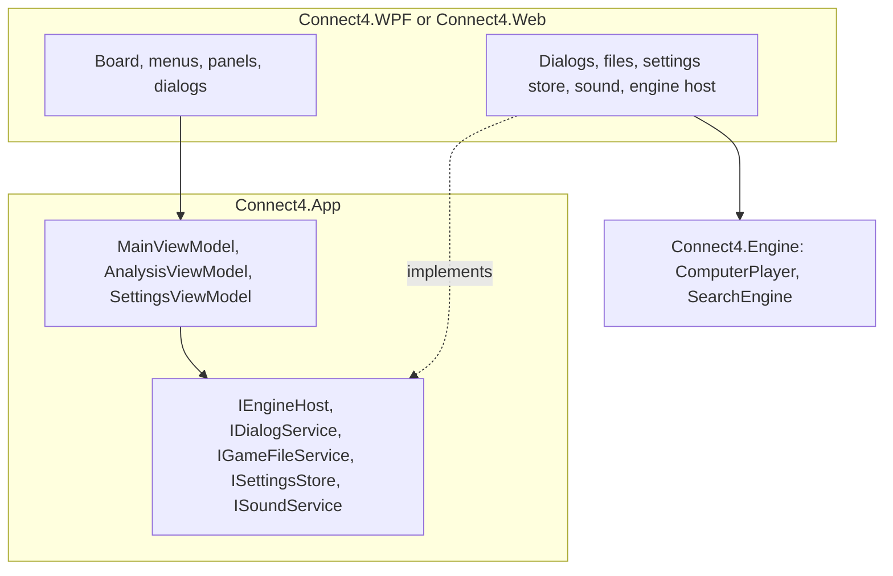

# 11 – App integration

[Back to the index](README.md)

## In short

The desktop app (WPF) and the web app (Blazor WebAssembly) share one view model, `MainViewModel` in `Connect4.App`. It runs the game: it plays the human's moves, asks the engine for the computer's moves in the background, and updates the board, the status and the analysis panel. The two apps only provide the windows and a few services.

## Layers

## The game loop

`MainViewModel` ([MainViewModel.cs](../../Connect4.Net/Connect4.App/ViewModels/MainViewModel.cs)):

1. `PlayCommand(column)` beeps if the computer is thinking, the game is over, it is not a human's turn, or the column is full. Otherwise it plays the move, plays the drop sound and starts the loop.
2. The loop refreshes the board. If the game is over it shows the result and plays the win, loss or draw sound. If a human is to move it waits. Otherwise it asks the engine for a move.
3. The computer's move is played like a human move, and the loop goes on.

Commands that change the game (New Game, Open, Undo, Redo, Switch Sides, changing the mode) first cancel a running search and wait until it has stopped.

| Mode | Who plays | Undo / Redo | Switch Sides |
|---|---|---|---|
| Human vs Computer (default, human is Red) | The human one colour, the computer the other | Back or forward to the human's previous or next turn | The human takes the computer's colour |
| Human vs Human | Both colours by hand | One move | Disabled |

When the mode is changed during a game, the human keeps the side to move and the computer takes the other colour. In Human vs Human the analysis panel stays empty.

## The engine host

`IEngineHost.ChooseMoveAsync(moves, limits, progress, cancel, moveNow)` gets the game as a list of columns, so the engine gets its own copy.

- **Desktop:** `LocalEngineHost` rebuilds the game and runs `ComputerPlayer.ChooseMove` on a thread-pool thread. `Progress<SearchInfo>` brings the reports back to the UI thread.
- **Browser:** `WebEngineHost` sends the request as JSON to a **Web Worker** that runs its own .NET runtime with the engine (`Worker/EngineWorker.cs`, `wwwroot/js/engine-worker.js`). Progress reports come back as messages, at most one per 100 ms unless the depth, the best move or the solver state changes. A running search cannot be interrupted inside the worker, so Move Now and Stop terminate the worker and start a new one; Move Now plays the best move reported so far. The new worker starts with empty hash tables.

In both, `NewGame()` clears the search hash table.

## The analysis panel

`AnalysisViewModel` shows the progress and the result: the move searched, the depth ("12 plies", or "solving (20 empty)"), the value, the best move, the expected line, the nodes and the time. Columns are shown 1–7. The value is shown from **Red's view**: "+25" is good for Red. Decided scores are shown as "Red wins in 3 moves" (counting the winner's moves) or "Draw".

## The board

| | Desktop | Browser |
|---|---|---|
| Columns | Seven transparent buttons over the board | Seven `<button>` columns |
| Hover | The next disc above the column (`MainViewModel.NextDisc`) | The same, with CSS |
| Drop animation | A falling `TranslateTransform`, accelerating | A CSS animation, accelerating |
| Clicks while a disc falls | Ignored | Ignored |
| Many discs at once (Open, Redo) | Shown at once | Shown at once |
| Winning line, last move | A white ring, a small dot | The same |
| Themes | — | Blue, Golden Oak, Reddish Wood; 3D discs; animation on or off |

## Settings and files

| | Desktop | Browser |
|---|---|---|
| Settings | `%AppData%\Connect4\settings.json` | Local storage (`connect4.settings`, `connect4.appearance`) |
| Games | Open and Save dialogs, `.txt` | File picker and download, `.txt` |
| Sound | `SoundPlayer`, one sound after the other | HTML audio, one after the other |

The settings are the time control (chapter 10), the game mode, whether the analysis panel and the sound are on, and the window position. The sounds are small WAV files generated by `SoundWaves` in `Connect4.App`, so neither app needs sound files.

## Memory

On the desktop the search table takes 128 MiB and the endgame table about 84 MB, the latter only after the solver has run once. The browser uses the same sizes in its worker, and falls back to smaller tables if the browser cannot allocate them.
