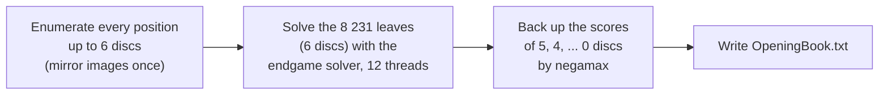

# 14 – Opening book

[Back to the index](README.md)

## In short

The first 6 plies are played from an **opening book**: the exact score of every position with at most 6 discs, 11 094 positions in all (mirror images once). The computer looks up the scores of the positions after each of its moves and plays the best one at once. The book is a text file built into the engine ([OpeningBook.txt](../../Connect4.Net/Connect4.Engine/Book/OpeningBook.txt)), made by the command-line tool `Connect4.Tools`. It gives perfect play in the opening, where the evaluation (chapter 05) is weakest, and costs no thinking time.

## What is in the book

Every position that can occur after 0 to 6 plies, with its exact **strong** score for the side to move in Pascal Pons' convention (chapter 09): 0 for a draw, otherwise 22 minus the number of the winner's disc, positive when the side to move wins. A position and its mirror image have the same score, so only one of them is stored.

| Discs | 0 | 1 | 2 | 3 | 4 | 5 | 6 | Total |
|---|---:|---:|---:|---:|---:|---:|---:|---:|
| Positions | 1 | 4 | 25 | 121 | 568 | 2 144 | 8 231 | 11 094 |

The empty board scores 1: Red wins with its last disc. The first moves score −2, −1, 0, +1, 0, −1, −2 for Red (columns 1–7), so only the centre wins; columns 3 and 5 draw.

## How the book is made



1. **Enumerate** (`BookBuilder.Enumerate`): breadth first from the empty board, every move that does not win at once, each position kept once by its `CanonicalKey` (the smaller of the position's key and its mirror's key, chapter 02). This is `generator.cpp explore` from connect4-master.
2. **Solve the leaves:** only the positions with exactly 6 discs are solved, with a strong solve by `EndgameSolver`. Each thread has its own solver and hash table.
3. **Back up** (`BookBuilder.BackUp`): the score of a shallower position follows from its children, by negamax:

   $$
   \text{score}(p) = \max_{\text{moves } m} \begin{cases} \lfloor (43 - n) / 2 \rfloor & \text{if } m \text{ wins at once} \\ -\text{score}(p + m) & \text{otherwise} \end{cases}
   $$

   where $n$ is the number of discs in $p$. The shallow positions are the expensive ones to solve (one position after 1 ply takes 40–143 seconds, a leaf after 6 plies 2 seconds on average), so backing up saves most of the work.

The C++ program has a book as well (`OpeningBook.hpp`, `7x6.book`), but it is a hash table of solved positions up to 14 plies, used by the solver. This book is much smaller, full-width, a text file, and used by the search.

### Measured cost

On an i7-12850HX (16 cores, 24 threads) with the C# solver, 12 threads and a $2^{24}$-entry table each (about 1 GB in all): **37 minutes** for the 8 231 leaves (3.7 leaves per second). Deeper books were estimated from samples before choosing the depth:

| Depth | Positions | Leaves | Mean solve per leaf | CPU time | 12 threads |
|---|---:|---:|---:|---:|---:|
| 6 | 11 094 | 8 231 | 1.9 s | 4.4 h | 37 min (measured) |
| 7 | 38 203 | 27 109 | 0.9 s | 7.1 h | ≈ 55 min |
| 8 | 129 498 | 91 295 | 0.5 s | 13.6 h | ≈ 1.7 h |

Depth 6 covers the opening with a small file (100 KB); the depth is a parameter of the tool.

## The tool

[Connect4.Tools](../../Connect4.Net/Connect4.Tools) is a console app around `Connect4.Engine/Book`:

```text
Connect4.Tools book generate --depth 6 [--workers N] [--table 24] [--out OpeningBook.txt]
Connect4.Tools book verify [--book OpeningBook.txt] [--sample 200] [--min-ply 3] [--seed S]
```

- `generate` shows the progress and the time left. Each solved leaf is appended at once to `OpeningBook.txt.partial`, so after Ctrl+C (or a crash) the same command continues where it stopped.
- `verify` checks the known first-move scores, that every shallower score is the back-up of its children, and solves a random sample of the book again.

## The file

```text
# Connect 4 opening book: depth 6, 11094 positions, one line "<moves> <score>" per position.
# ...
 1
1 2
2 1
3 0
4 -1
11 1
12 -2
...
```

One line per position, as in Pascal Pons' test files: the columns played (1–7) and the score. The first line, with no moves, is the empty board. The file is an embedded resource of `Connect4.Engine`, so both the desktop app and the browser's worker have it without an extra download. `OpeningBook.Default` reads it the first time it is used (a few milliseconds) into a sorted array of `ulong` values, `CanonicalKey << 8 | (score + 64)`, which is searched with binary search.

## How the search uses it

At the start of `SearchEngine.Search` (chapter 07), if `SearchLimits.UseBook` is on and the position has fewer than 6 discs:

1. Every child is looked up (by its canonical key) and gets the score −(child score), or the win score if the move wins at once.
2. The best moves are kept, and one is picked at random with the engine's random generator, as for equal moves in the search. Mirror moves always have the same score, so for example after `44` the replies in columns 3 and 5 are chosen at random.
3. The result is `ScoreKind.Exact` with the score converted from the solver convention (`Scores.FromSolver`), depth 0, no nodes, and `FromBook = true`. The analysis panel shows "book" and the exact result, e.g. "Red wins in 21 moves".

A position with 6 discs has a score in the book but no move, so the normal search plays from there. The book covers every reply of the opponent, including bad ones, so it is used for 3 moves of each side in every game.

"Use opening book" in the Settings dialog (on by default) turns it off; the setting becomes `SearchLimits.UseBook`.

## How it is tested

- [OpeningBookTests.cs](../../Connect4.Net/Connect4.Engine.Tests/OpeningBookTests.cs): `Mirror` and `CanonicalKey`; the number of positions per ply; the back-up compared with a plain negamax over a fake solver; the fastest win; the file format; lookups of mirror images; best moves and random ties.
- [BuiltInBookTests.cs](../../Connect4.Net/Connect4.Engine.Tests/BuiltInBookTests.cs): the built-in book has 11 094 positions, the known first-move scores, a consistent back-up, and the same scores as every position with at most 6 moves in Pascal Pons' test sets `Test_L1_R1`–`R3`; the search plays the centre from the book at once, picks among equal book moves at random, and searches when the book is off or the position is deeper. A slow test solves 50 random leaves again.
