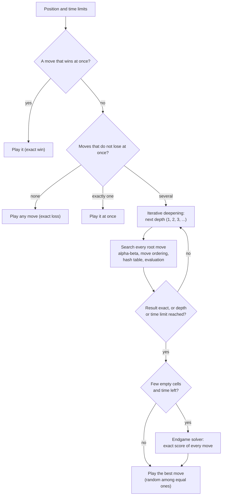

# The Connect 4 brain

Connect 4 is a game for two players on a board with 7 columns and 6 rows. The computer's "brain" is the engine library `Connect4.Engine`, which decides the computer's move. It consists of:

- **the board and rules**: bitboards, move generation and threat detection, ported from Pascal Pons' C++ solver (connect4-master);
- **the evaluation**: threats, odd/even rows, open lines and centre control;
- **the search**: iterative deepening alpha-beta (principal variation search) with a hash table, stopped by a depth or time limit, as in Stello;
- **the endgame solver**: the C++ solver, ported 1:1, which finds the exact result near the end of the game.

There is no opening book. These documents explain how the parts work and how they fit together. They describe the C# code in [Connect4.Net](../../Connect4.Net). How the C++ code was ported, and what was changed, is described in [Connect 4 porting documentation.md](../../Connect%204%20porting%20documentation.md).

## The brain on one page

This is how the computer finds a move. Each box is explained in a chapter.

The time limit can stop the search at any point; the best move of the last finished depth is then played. If the endgame solver does not finish in time, the move of the heuristic search is played.

## Chapters

| # | Chapter | Content |
|---|---|---|
| 01 | [Overview](01-overview.md) | Projects, main types, the life of one computer move |
| 02 | [Board and bitboard](02-board-and-bitboard.md) | The 49-bit layout, the position key, cells and columns |
| 03 | [Rules and move generation](03-rules-and-move-generation.md) | Playing a move, winning cells, non-losing moves, perft |
| 04 | [Game record](04-game-record.md) | Move history, undo/redo, the winner, the text file format |
| 05 | [Evaluation](05-evaluation.md) | Threats, odd/even rows, stacked threats, open lines, centre |
| 06 | [Move ordering](06-move-ordering.md) | Hash move, winning cells after the move, centre first |
| 07 | [Search](07-search.md) | Negamax alpha-beta, iterative deepening, PVS, forced moves, equal moves |
| 08 | [Transposition table](08-transposition-table.md) | One packed 64-bit entry, the bijective hash, replacement |
| 09 | [Endgame solver](09-endgame-solver.md) | The C++ solver, its scores and table, when it is used |
| 10 | [Time control](10-time-control.md) | Time modes, soft and hard limits, Move Now |
| 11 | [App integration](11-app-integration.md) | The game loop, threading, the browser worker, settings |
| 12 | [Glossary](12-glossary.md) | The terms used in these documents |
| 13 | [References](13-references.md) | Articles and source code on the internet |

## Reading paths

- **Everything:** read the chapters in order.
- **Just the search:** 01, 02, 03, 05, 06, 07, 08, 09.
- **Tuning the engine:** 05, 06, 07, 09, 10.
- **Changing the app:** 01, 10, 11.

## How to view these documents

- **On GitHub:** diagrams and formulas are shown directly.
- **In the web version:** Brain > How Connect 4 Thinks.
- **In VS Code:** open the Markdown preview (Ctrl+Shift+V). The diagrams need the extension *Markdown Preview Mermaid Support* (`bierner.markdown-mermaid`).

The diagrams are written in [Mermaid](https://mermaid.js.org/) and the formulas in LaTeX math.
